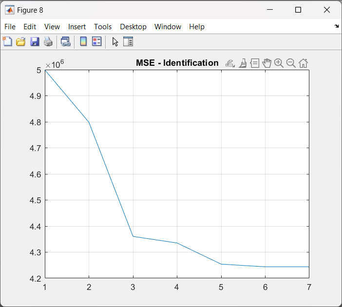
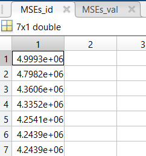
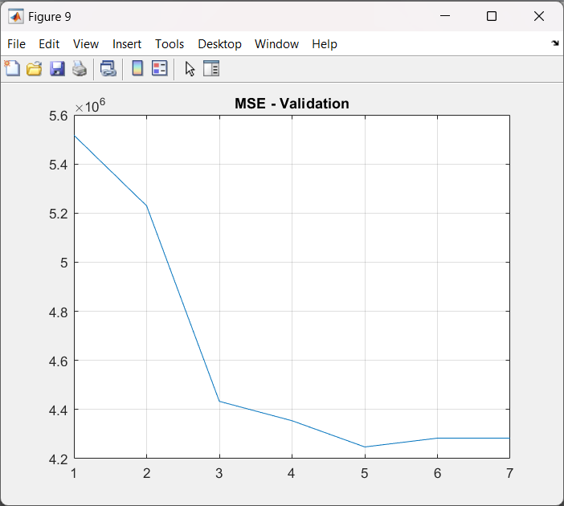
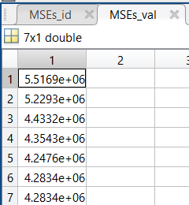

# System Identification Project Report

*Group 30332*

*Incer Maia*  

*Kiss Tamás Norbert*

*Laza Oana Stefania*

## Introduction
This project is meant to treat the topic of model approximation of a linear trend given by the sold items of an engineering store, over the course of a few years.

That being the case, depending on the season, there will be different quantities of the same product sold, according to a certain demand. 

In winter time, people need boilers/different heating systems, whereas in the warm months they look for air-cooling systems. The data used for approximation consists of the quantity of product units sold over a number of months.

## Description
In general, functions are written as the sum of simple waves mathematically represented by sines and cosines. We were given a data set which contained a periodic input signal, and in order to get the approximation, we needed to analyze its trend (how it goes up and down in a specific time stamp).

As a brief description of the project, we will present the Fourier function that we used in order to solve the approximation problem and why we thought that this one is the best fit for what we need.

The Fourier function is one of the most used and powerful functions in mathematical history, and knowing that there's no better periodic function than the sinusoidal and cosine one, we chose to use the Fourier series approximation that contained both sin and cos, written as:

y(k) = t₀ + t₁*k + Σ[i=1 to m] [aᵢ * cos(2πik/P) + bᵢ * sin(2πik/P)]

This formula consists of a first-order element, `t₀ + t₁*k`, and a Fourier basis depending on the number of samples, `m`. Choosing the right value for `m` is one of the most important things in the approximation problem because we can face a lot of problems like over-fitting (m too big) - which occurs when the model fits exactly against its training data, id error small, val error large and under-fitting (m too small) - meaning that the model makes accurate but initially incorrect predictions, both id and val error are larger than they should be.

For example, it would be a big red flag if our model saw 89% accuracy on the identification data set but only 60% accuracy on the validation data set. So the number of samples/Fourier terms directly affects the approximation, making it more or less accurate.

In our case, we have monthly data => a yearly periodicity signal, meaning that in order to solve the approximation problem we have to use the period P=12. Every term is connected to a sin or cos depending on the position of the element in the series; the odd-positioned elements are connected with the cos function, and the even-positioned elements are connected with the sin function.

Having all this information, the next step is to compose the structure of this function and to apply the linear regression method to it in order to get the desired parameter vector theta.

The main goal of this project is to find the optimal parameter vector theta so that the approximation mean-squared error is minimum.

## Key Features
In the structure of the regressor ϕ (using the ARX linear model), we connected every odd-positioned element with a cosine Fourier term and every even-positioned element with a sine Fourier term, in order to obtain the matrix form for the linear regression method.

ϕ(k) = [1, k, Σ[i=1 to m] [aᵢ * cos(2πik/P) + bᵢ * sin(2πik/P)]]
θ = ϕ/y_id
θ = [t₀, t₁, a₁, b₁, ... aₘ, bₘ]
ŷ(k) = ϕ * θ
ŷ(k) = [1, k, Σ[i=1 to m] [aᵢ * cos(2πik/P) + bᵢ * sin(2πik/P)]] * [t₀, t₁, a₁, b₁, ... aₘ, bₘ]

In order to test the accuracy of the approximation, we should compute the mean-squared error. For getting the best approximation, we have to use the same method both on the identification data set and validation data set after determining the parametric vector theta.

## Results

To find the best approximation, we needed to compare the results we obtained using a number `m`, that is defined as the number of samples. If the chosen `m` is too big, it will lead to over-fitting (low identification error, high validation error) or if `m` is too small, the approximation process will lead to under-fitting (high identification error, high validation error). So, for each `m`, between 1 and 7, we computed theta and the MSEs (identification and validation).

After computing the errors, we represented them in a graph to find the best `m`, which corresponds to the lowest value of the validation error vector. In our case, we found out that `m = 5` is the best number of samples for our data approximation.

For example, if our model's accuracy regarding the identification data set is 90%, but the validation data set accuracy stands at about 60%, the value of `m` should be reconsidered.

## Conclusion

This method has impressive accuracy; we obtained great values for the MSEs both identification and validation, meaning that we chose the right value for `m`, and it's proving the fact that the Fourier series approximation is one of the best fit for our problem.

## Bibliography

- [sFFT Paper](https://groups.csail.mit.edu/netmit/sFFT/soda_paper.pdf)
- [Wikipedia - Fourier Transform](https://en.wikipedia.org/wiki/Fourier_transform)
- [Overfitting and Underfitting Principles](https://towardsdatascience.com/overfitting-and-underfitting-principles-ea8964d9c45c)
